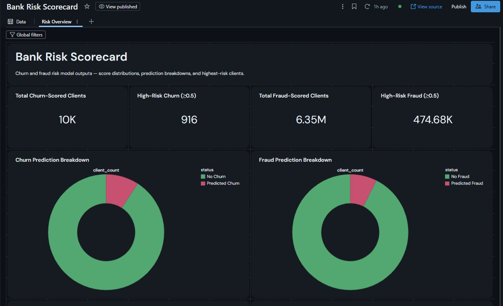

# Bank Client Risk Pipeline

An end-to-end Databricks/PySpark pipeline that scores bank clients on two
independent risk types — churn and fraud/anomaly — from a shared
Bronze → Silver → Gold feature architecture.

## Overview

Most client risk-scoring systems at a bank are built as one shared
behavioral feature layer feeding multiple downstream models, rather than
one model per risk type built from scratch. This project follows that
pattern: a single ingestion → cleaning → feature-engineering pipeline in
PySpark, with two separate PySpark MLlib classifiers trained on top —
one predicting customer churn, one predicting fraudulent/anomalous
transaction behavior.

## Architecture

- **Bronze** — raw CSVs landed into Delta tables, unmodified
- **Silver** — cleaned, deduplicated, with engineered features
  (for fraud: per-client transaction-amount z-scores computed via
  distributed window functions)
- **Gold** — client-level aggregate tables with a label column, ready
  for model training
- Two PySpark MLlib `RandomForestClassifier` pipelines trained on the
  Gold tables, plus an Isolation Forest anomaly layer on the fraud side
- Orchestrated as a Databricks Job (Bronze → Silver → Gold → Train)
- Scored output written to Delta tables and visualized in a dashboard

## Datasets

- **Churn** — [Bank Customer Churn](https://www.kaggle.com/datasets/santoshd3/bank-customers) — 10,000 customers, labeled `Exited`
- **Fraud** — [PaySim Synthetic Financial Dataset](https://www.kaggle.com/datasets/ealaxi/paysim1) — 6.36M mobile-money transactions, labeled `isFraud`

## Tech stack

Databricks · PySpark (DataFrame API, window functions, MLlib) · Delta Lake
· scikit-learn (Isolation Forest) · Databricks Workflows · Databricks
Dashboards

## Repository structure

- `notebooks/` — the four pipeline notebooks, in run order
- `images/` — dashboard screenshots referenced below

## How to run

1. Load both datasets into a Unity Catalog volume.
2. Run `01_bronze_ingest.py` → `02_silver_features.py` →
   `03_gold_aggregates.py` → `04_train_models.py`, in order, or chain
   them as a Databricks Job with task dependencies.
3. Point a dashboard at the `risk_scores_churn` and `risk_scores_fraud`
   output tables.

## Results

| | Churn model | Fraud model |
|---|---|---|
| Clients scored | 10,000 | 6.35M |
| Flagged high-risk (≥0.5) | 916 | 474,680 |

## Known limitations & next steps

- The fraud model is trained on client-level aggregates, but most
  `nameOrig` accounts in PaySim originate only a single transaction —
  which means per-client features like transaction-amount standard
  deviation are undefined for most rows, and the model has limited
  signal to work with. This shows up as a clumped, non-smooth score
  distribution and an implausibly high flagged-client rate (~7.5%
  ≥0.5, versus a real-world fraud base rate closer to 0.1–1%).
- Planned fix: retrain the fraud model at the transaction level
  (label = `isFraud` per transaction) instead of the client level, then
  roll flagged transactions up to flagged clients afterward — this also
  scales the training set from ~6M near-duplicate client rows to tens
  of millions of transaction rows.
- Churn model probabilities show ties at the top of the risk ranking
  (multiple clients at exactly 0.89) — expected for a Random Forest
  with largely categorical features, but worth a manual spot-check
  against the underlying `CustomerId`s before treating the ranking as final.
